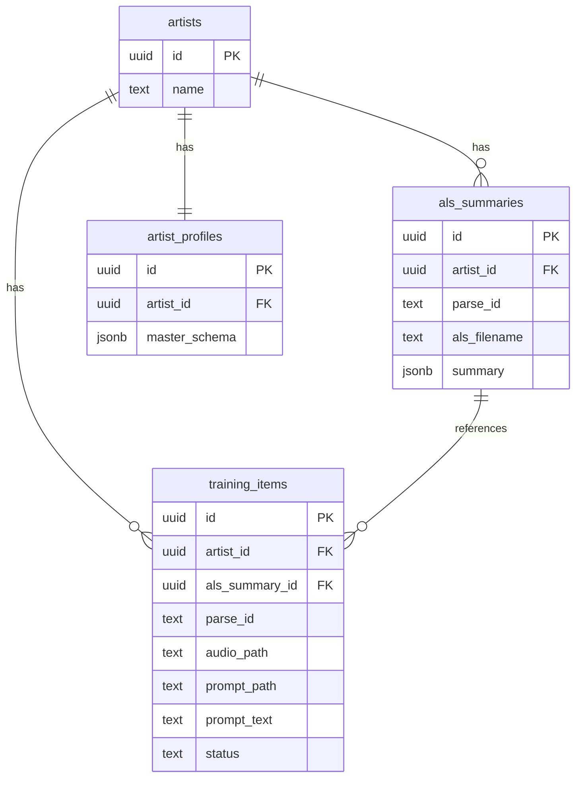
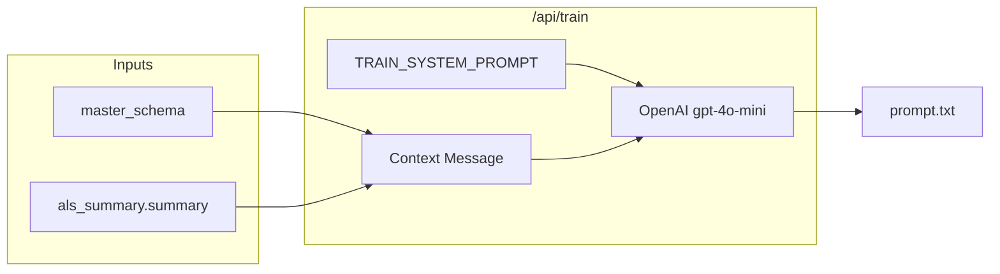
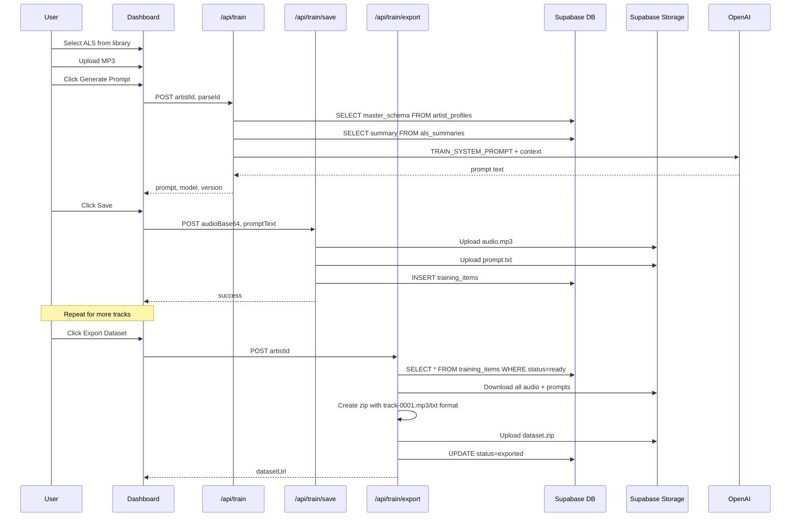

# Train Mode Architecture Diagram

## Deliverable

Create a new file: [`docs/train-mode-architecture.md`](docs/train-mode-architecture.md)

This will contain Mermaid diagrams showing:

1. **Database Entity Relationships** - How `artist_profiles`, `als_summaries`, `training_items`, and `artists` tables connect
2. **Prompt Generation Flow** - How `TRAIN_SYSTEM_PROMPT` receives `master_schema` + `summary` and outputs a training prompt
3. **Full Train Workflow** - User actions → API calls → Storage → Export

## Proposed Diagrams

### 1. Database Schema (ERD)

### 2. Prompt Generation Flow

### 3. Full Train Mode Sequence

## File Structure

The markdown file will include:

- Brief intro explaining Train Mode purpose
- All three diagrams with explanatory text
- Reference to relevant code files