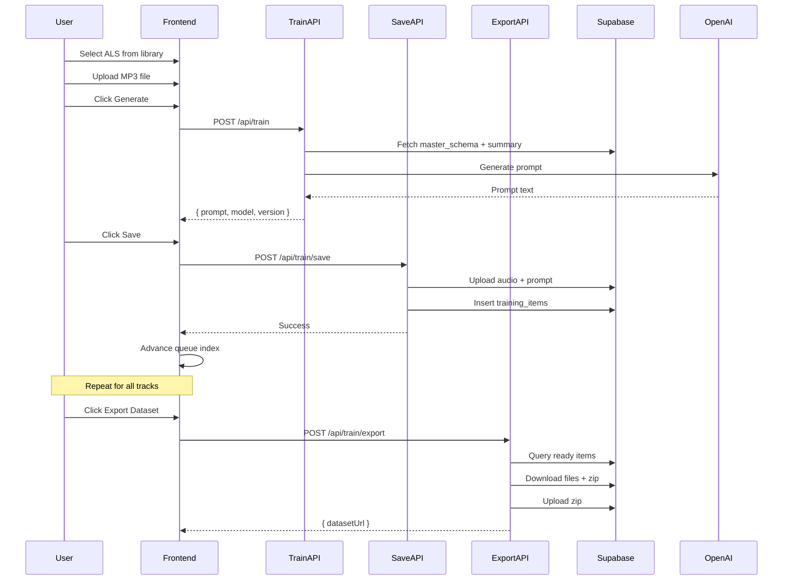

# Train Mode Implementation

## Database Setup

### New table: `training_items`

```sql
CREATE TABLE training_items (
  id uuid PRIMARY KEY DEFAULT gen_random_uuid(),
  artist_id uuid REFERENCES artists(id) ON DELETE CASCADE,
  als_summary_id uuid REFERENCES als_summaries(id) ON DELETE SET NULL,
  
  -- Denormalized for easier querying (avoids joins)
  parse_id text NOT NULL,
  als_filename text,
  project_name text,
  
  -- File paths in Storage
  audio_path text,           -- artists/{slug}/training/{id}/audio.mp3
  prompt_path text,          -- artists/{slug}/training/{id}/prompt.txt
  prompt_text text,          -- Cached for UI display
  
  -- Status workflow
  status text DEFAULT 'needs_audio',  -- needs_audio | needs_prompt | ready | exported | failed
  
  -- Prompt provenance (for reproducibility)
  system_prompt_version text,  -- e.g., "train-v1"
  model_name text,             -- e.g., "gpt-4o-mini"
  generated_at timestamptz,
  
  created_at timestamptz DEFAULT now(),
  updated_at timestamptz DEFAULT now()
);

CREATE INDEX idx_training_items_artist_status ON training_items(artist_id, status);
```

## Storage Structure

```
dawa-exports/artists/{artist-slug}/training/{training_item_id}/
  audio.mp3
  prompt.txt

dawa-exports/artists/{artist-slug}/datasets/
  dataset-{timestamp}.zip
```

## Implementation

### 1. Train Mode State in [`app/dashboard/page.tsx`](app/dashboard/page.tsx)

```tsx
// Queue for batch processing
const [trainQueue, setTrainQueue] = useState<string[]>([]);  // parse_ids
const [trainIndex, setTrainIndex] = useState(0);

// Current item state
const [trainAudioFile, setTrainAudioFile] = useState<File | null>(null);
const [trainPrompt, setTrainPrompt] = useState<string | null>(null);
const [trainLoading, setTrainLoading] = useState(false);
```

### 2. Train Mode UI

When `chatMode === "train"`:

- Show instruction based on state
- Display selected ALS name (from `selectedParse`)
- File upload dropzone for MP3 (drag-drop or click)
- "Generate Prompt" button (enabled when ALS selected + audio uploaded)
- Display generated prompt
- "Save & Next" button to commit and advance queue

### 3. API Routes

| Route | Method | Purpose |

|-------|--------|---------|

| `/api/train` | POST | Generate prompt from master_schema + summary |

| `/api/train/save` | POST | Upload files to Storage, insert DB row (server-side) |

| `/api/train/export` | POST | Zip ready items, upload to Storage, return URL |

### 4. Train API `/api/train/route.ts`

```tsx
POST { artistId, parseId }

1. Fetch master_schema from artist_profiles WHERE artist_id
2. Fetch summary from als_summaries WHERE parse_id
3. Call OpenAI with TRAIN_SYSTEM_PROMPT + context
4. Return { prompt, model: "gpt-4o-mini", version: "train-v1" }
```

### 5. Save API `/api/train/save/route.ts` (server-side uploads)

```tsx
POST { artistId, parseId, alsFilename, projectName, audioBase64, promptText }

1. Generate training_item id
2. Upload audio.mp3 to Storage (using service role key)
3. Upload prompt.txt to Storage
4. Insert training_items row with status='ready'
5. Return { success, trainingItemId }
```

Server-side uploads avoid RLS policy issues on Storage.

### 6. Export API `/api/train/export/route.ts`

```tsx
POST { artistId }

1. Query training_items WHERE artist_id AND status='ready'
2. For each item:
   - Download audio from Storage
   - Download prompt from Storage
3. Create zip with structure: dataset/item-{n}/audio.mp3, prompt.txt
4. Upload zip to Storage
5. Update items status='exported'
6. Return { datasetUrl } (public/signed URL for Replicate)
```

### 7. Training Queue Display

Show completed training_items for current artist:

- Track name + status badge
- "Export Dataset" button (enabled when ready items exist)
- Progress: "3/10 ready"

## File Changes

| File | Changes |

|------|---------|

| [`app/dashboard/page.tsx`](app/dashboard/page.tsx) | Train UI, queue state, file upload |

| `app/api/train/route.ts` | Prompt generation |

| `app/api/train/save/route.ts` | Server-side file upload + DB insert |

| `app/api/train/export/route.ts` | Zip generation + Storage upload |

| [`docs/supabase-schema.md`](docs/supabase-schema.md) | Document training_items table |

## Flow Diagram

