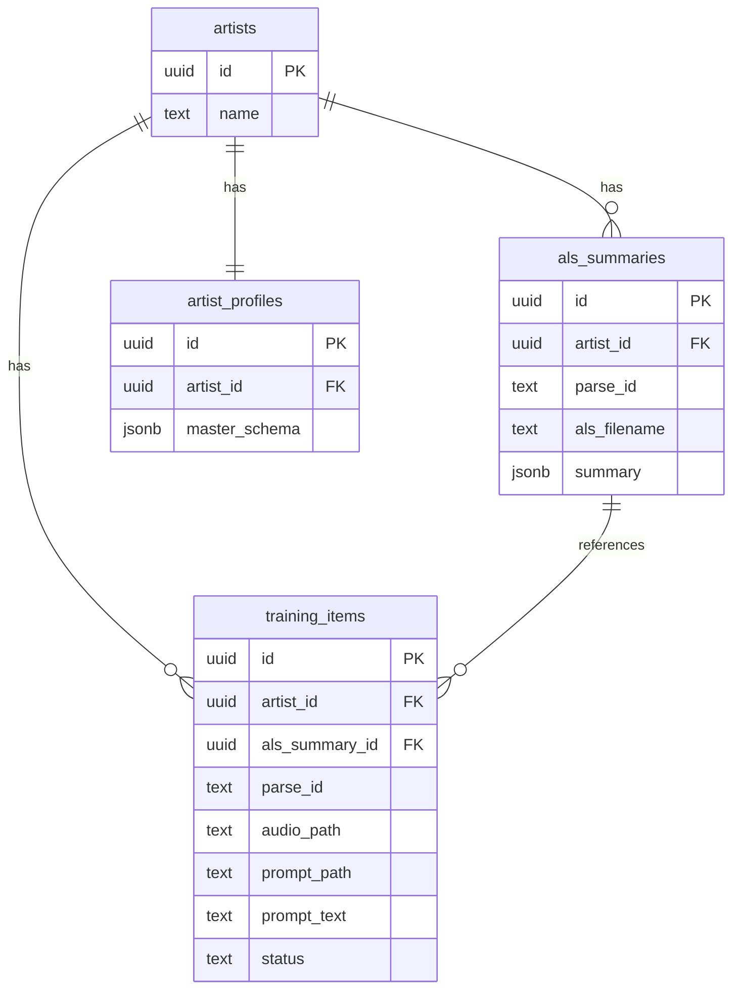
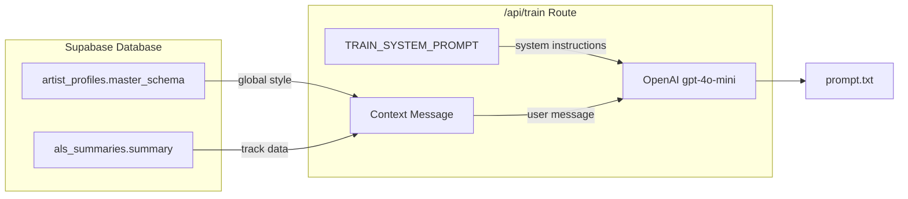
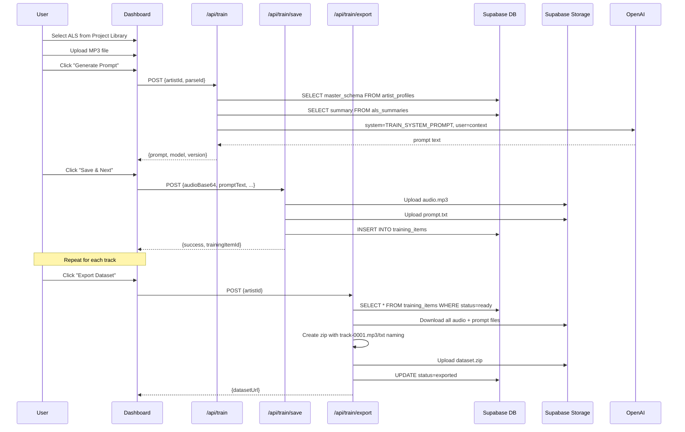
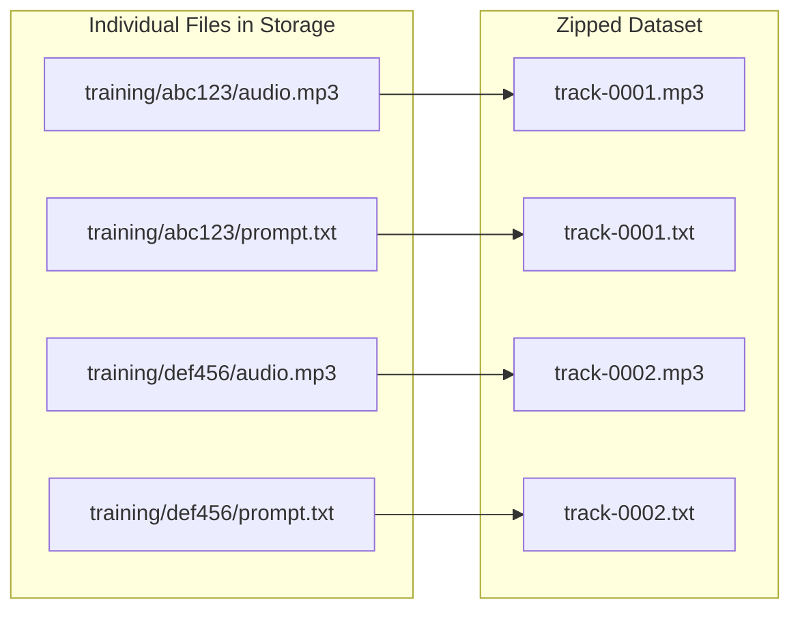

# Train Mode Architecture

This document explains how Train Mode works in the DAWA Dashboard, including database relationships, the prompt generation flow, and the export process.

---

## Database Schema

The Train Mode uses four main tables. The `training_items` table stores each audio + prompt pair.



---

## Prompt Generation Flow

The `/api/train` route generates training prompts by combining the artist's style profile with track-specific data.



### What Each Input Provides

| Input | Source | Purpose |
|-------|--------|---------|
| `master_schema` | `artist_profiles` table | Global artist style: genre, vocabulary, emotional tone, creative constraints |
| `summary` | `als_summaries` table | Track-specific: BPM, plugins, instruments, arrangement, density |
| `TRAIN_SYSTEM_PROMPT` | Hardcoded in route | Output format rules, example style, constraints |

### System Prompt Structure

The `TRAIN_SYSTEM_PROMPT` instructs the model to:
1. Output plain text only (no JSON, no markdown)
2. Write 1-2 dense, sync-ready sentences
3. End with `BPM: <number>`
4. Use `master_schema` for stylistic language
5. Use `summary` for track-specific details

---

## Full Train Mode Sequence

This diagram shows the complete user workflow from selecting a track to exporting the dataset.



---

## Storage Structure

Files are organized by artist in the `dawa-exports` bucket:

```
dawa-exports/
└── artists/{artist-slug}/
    ├── training/{training-item-id}/
    │   ├── audio.mp3       ← uploaded by /api/train/save
    │   └── prompt.txt      ← uploaded by /api/train/save
    └── datasets/
        └── dataset-{timestamp}.zip   ← created by /api/train/export
```

---

## Export Dataset Format

Replicate requires audio and text files to share the same base name. The export route renames files automatically:



Final zip structure:
```
dataset/
  track-0001.mp3
  track-0001.txt
  track-0002.mp3
  track-0002.txt
  ...
```

---

## API Routes Reference

| Route | Method | Input | Output |
|-------|--------|-------|--------|
| `/api/train` | POST | `{artistId, parseId}` | `{prompt, model, version}` |
| `/api/train/save` | POST | `{artistId, parseId, audioBase64, promptText, ...}` | `{success, trainingItemId}` |
| `/api/train/export` | POST | `{artistId}` | `{datasetUrl, itemCount}` |

---

## Related Files

- [`app/api/train/route.ts`](../app/api/train/route.ts) — Prompt generation
- [`app/api/train/save/route.ts`](../app/api/train/save/route.ts) — File upload + DB insert
- [`app/api/train/export/route.ts`](../app/api/train/export/route.ts) — Zip creation + upload
- [`app/dashboard/page.tsx`](../app/dashboard/page.tsx) — Train mode UI
- [`supabase/migrations/001_training_items.sql`](../supabase/migrations/001_training_items.sql) — Table schema

